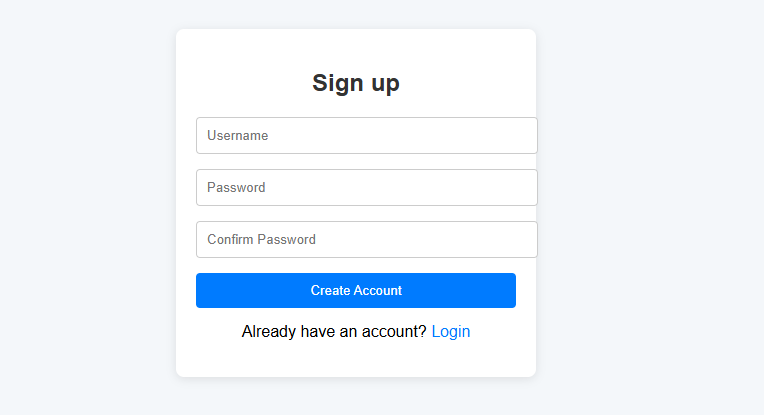
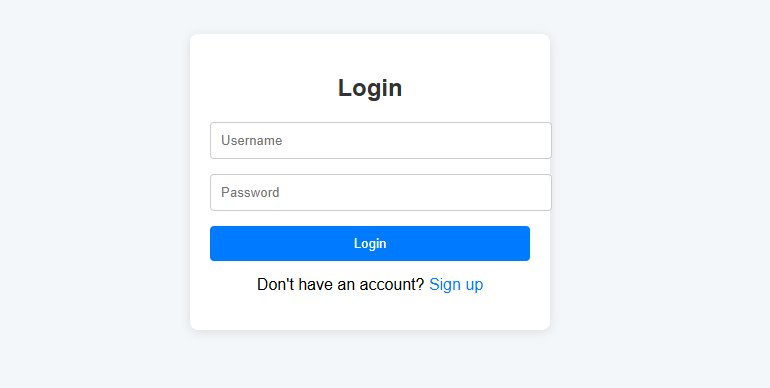
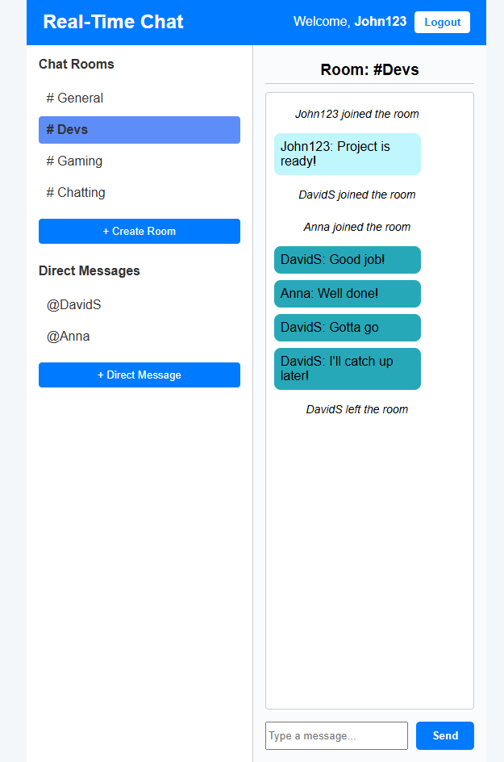
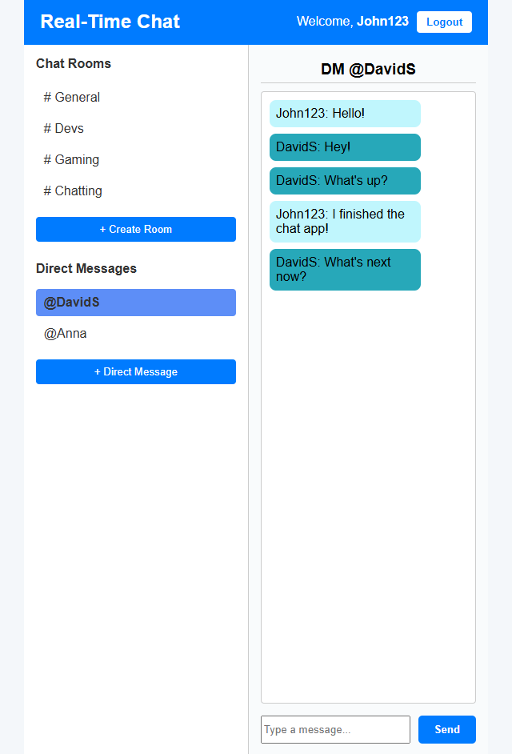

# Real-Time Chat App

A real-time chat application built with **FastAPI**, **WebSockets**, **Redis**, and **PostgreSQL** on the backend, and **HTML**, **CSS**, and **JavaScript** on the frontend. Users can sign up, log in, and start chatting in public rooms or private direct messages (DMs).

---
## Contents

- [Features](#features)
- [Tech Stack](#tech-stack)
- [Usage](#usage)
- [How to Install](#how-to-install)
- [Development](#development)
- [Testing](#testing)
- [License](#license)

---
## Features

- Real-time communication using WebSockets
- Chat rooms & private (DM) conversations
- Redis pub/sub for message broadcasting
- PostgreSQL database support with Alembic migrations
- Dockerized app and services
- HTML, CSS, Vanilla JS frontend
- User authentication with JWT
- Secure access using tokens

---
## Tech Stack

**Backend:**
- Python 3.11
- FastAPI
- SQLAlchemy
- Alembic
- PostgreSQL
- Redis
- JWT
- Docker

**Frontend:**
- HTML
- CSS
- JavaScript (Vanilla)

---
## Usage

1. Sign Up and Log In:

-  Create an account in signup page.



- Login in the login page.



2. Creat a room and chat, or send a DM.

- Chat in rooms.



- Send DMs.



---
## How to Install

### Prerequisites
- Docker & Docker Compose
- Python 3.11 (for local dev)

1. Clone the repository

```bash
git clone https://github.com/idalz/realtime-chat-app.git
```

2. Set up enviroment variables:

Create a `.env` file in the root directory (realtime-chat-app) and add the following variables:

```
DATABASE_URL=postgresql+psycopg2://<your-username>:<your-password>@db/chat_db
POSTGRES_USER=<your-username>
POSTGRES_PASSWORD=<your-password>
POSTGRES_DB=chat_db
SECRET_KEY=<your-secret-key>
REDIS_URL=redis://redis:6379
```

3.Docker Setup:

Run the following command to start the application and database container:

```bash
docker-compose up --build
```

This will:

Build and start all the containers (app, postgreSQL, redis and redis worker).
Persist data in a Docker volume so database content is saved.

4. Database Setup (with Alembic):

Inside the app container run the following to set up the schemas:

```bash
docker-compose exec app alembic upgrade head
```

This will create the necessary tables: `users`, `rooms` and `messages`.

5. Run the application:

The app will be running at http://localhost:8000.

---
## Development

Running locally without Docker:

1. Install the dependencies:

```bash
pip install -r requirements.txt
```

2. Set up the environment variables in `.env`:

You may need to change the `DATABASE_URL` to `localhost`:

```
DATABASE_URL=postgresql+psycopg2://<your-username>:<your-password>@localhost:5432/chat_db
...
```

3. Create a PostgreSQL database named `chat_db`.

4. Run Alembic Migrations Locally:

```bash
alembic upgrade head
```

5. Run the FastAPI app:

```bash
uvicorn app.main:app --reload
```

6. Access the app at http://localhost:8000.

---
## Testing 

if you would like to run tests, ensure you installed `pytest`:

```bash
pip install pytest
```

Tests currently use SQLite db.

---
## License

This project is licensed under the MIT License.
